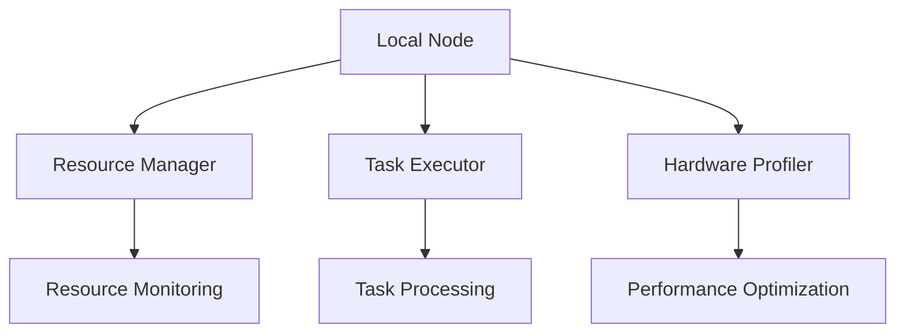

# Tenzro Local Node

An individual computation node for the Tenzro Network, responsible for executing tasks, managing resources, and participating in the distributed network. Local nodes form the foundation of the Tenzro Network, providing computational resources and participating in the decentralized task execution system.

## Features

- **Task Execution**: Efficient processing of various computation tasks
- **Resource Management**: Dynamic allocation and monitoring of system resources
- **Hardware Profiling**: Automatic detection and optimization of system capabilities
- **Peer Discovery**: Local network formation with nearby nodes
- **Node Aggregation**: Dynamic grouping for enhanced processing power
- **Metrics Collection**: Comprehensive performance monitoring and reporting
- **Regional Node Integration**: Secure communication with validator nodes
- **Fault Tolerance**: Robust error handling and recovery mechanisms

## Prerequisites

- Node.js 18.x or higher
- npm 10.x or higher
- Docker (optional, for containerized deployment)
- Minimum hardware requirements:
  - 2+ CPU cores
  - 4GB RAM (8GB+ recommended)
  - 20GB available storage
  - 10+ Mbps network connection

## Installation

```bash
# Clone the repository
git clone https://github.com/tenzro/local-node.git
cd local-node

# Install dependencies
npm install

# Copy environment configuration
cp .env.example .env

# Build the project
npm run build
```

## Configuration

Edit your `.env` file with appropriate settings:

```env
# Node Configuration
NODE_ENV=production
NODE_TYPE=individual
NODE_TIER=inference
REGION=us-east
TOKEN_BALANCE=1000

# Network Configuration
DHT_ENABLED=true
DHT_REFRESH_INTERVAL=60000
METRICS_UPDATE_INTERVAL=15000
HEALTH_CHECK_INTERVAL=30000
BOOTSTRAP_NODES=wss://regional-node.tenzro.org

# Hardware Configuration
MIN_CPU_CORES=2
MIN_MEMORY_GB=4
MIN_STORAGE_GB=20
GPU_REQUIRED=false

# Task Configuration
MAX_CONCURRENT_TASKS=5
TASK_TIMEOUT=1800
RESULT_RETENTION_PERIOD=86400
```

## Running the Node

### Development Mode

```bash
# Start with hot reloading
npm run dev

# Run tests
npm test

# Run linting
npm run lint
```

### Production Mode

```bash
# Build and start
npm run build
npm start
```

### Docker Deployment

```bash
# Build image
docker build -t tenzro-local-node .

# Run container
docker-compose up -d
```

### Heroku Deployment

```bash
# Login to Heroku
heroku login

# Create Heroku app
heroku create tenzro-local-node-[region]

# Configure environment variables
heroku config:set \
    NODE_ENV=production \
    NODE_TYPE=individual \
    NODE_TIER=inference \
    REGION=[region] \
    -a tenzro-local-node-[region]

# Deploy
git push heroku main
```

## API Endpoints

### Node Management
- `GET /health` - Check node health status
- `GET /status` - Get node status and metrics
- `GET /api/hardware/profile` - Get hardware capabilities

### Task Management
- `POST /api/tasks/execute` - Submit task for execution
- `GET /api/tasks/:taskId` - Get task status
- `GET /api/tasks/:taskId/result` - Get task result

### Resource Management
- `GET /api/resources/status` - Get current resource usage
- `GET /api/resources/limits` - Get resource limits
- `GET /api/metrics` - Get performance metrics

## Architecture



### Core Components

1. **Local Node Manager**
   - Core node operations
   - State management
   - Component coordination

2. **Hardware Profiler**
   - System capability detection
   - Performance benchmarking
   - Resource optimization

3. **Resource Manager**
   - Resource allocation
   - Usage monitoring
   - Quota enforcement

4. **Task Executor**
   - Task validation
   - Execution management
   - Result handling

5. **Network Manager**
   - P2P communication
   - Node discovery
   - Connection management

6. **Metrics Collector**
   - Performance monitoring
   - Resource tracking
   - Network statistics

## Node Aggregation

Local nodes can participate in dynamic node aggregation:

### Discovery Phase
- Automatic discovery of nearby nodes
- Capability assessment
- Connection establishment

### Eligibility Criteria
- Minimum tier requirements
- Compatible hardware profiles
- Sufficient available resources
- Network proximity

### Formation Process
- Dynamic group formation
- Resource pooling
- Capability enhancement
- Role assignment

### Management
- Coordinated task distribution
- Shared resource management
- Fault tolerance
- Load balancing

## Security

### Communication Security
- TLS encryption for all connections
- WebSocket secure protocol (WSS)
- Message signing and verification
- Secure key exchange

### Resource Protection
- Task isolation
- Resource quotas
- Usage monitoring
- Access control

### Access Control
- Node authentication
- Task validation
- Permission management
- Role-based access

## Error Handling

Example error handling implementation:

```typescript
try {
    // Task execution
    await taskManager.executeTask(task);
} catch (error) {
    if (error instanceof ResourceError) {
        // Handle resource allocation errors
        await resourceManager.handleResourceFailure(error);
    } else if (error instanceof NetworkError) {
        // Handle network-related errors
        await networkManager.handleConnectionFailure(error);
    } else {
        // Handle other errors
        logger.error('Task execution failed', error);
    }
}
```

## Monitoring and Metrics

### Performance Metrics
- CPU utilization
- Memory usage
- Network bandwidth
- Task throughput
- Response times

### Health Checks
- Resource availability
- Network connectivity
- Service status
- Component health

### Logging
- Operation logs
- Error tracking
- Performance data
- Security events

## Maintenance

### Regular Tasks

```bash
# Update node software
npm update

# Check system health
npm run health-check

# Backup configuration
npm run backup-config

# Clean old logs
npm run clean-logs
```

### Troubleshooting

1. Connection Issues:
```bash
# Check network status
npm run network-diagnostics

# Reset connections
npm run reset-connections
```

2. Resource Problems:
```bash
# Run resource diagnostics
npm run resource-check

# Clear resource allocations
npm run clear-resources
```

## Development

### Contributing

1. Fork the repository
2. Create your feature branch (`git checkout -b feature/AmazingFeature`)
3. Commit your changes (`git commit -m 'Add some AmazingFeature'`)
4. Push to the branch (`git push origin feature/AmazingFeature`)
5. Open a Pull Request

### Testing

```bash
# Run all tests
npm test

# Run specific test suite
npm test -- --suite=resources

# Run with coverage
npm run test:coverage
```

### Code Style

- Follow TypeScript best practices
- Use ESLint for code quality
- Format with Prettier
- Write comprehensive tests
- Document all public APIs
- Maintain consistent naming conventions

## Support

- Report bugs and issues on [GitHub Issues](https://github.com/tenzro/local-node/issues)
- Read the documentation at [docs.tenzro.org](https://docs.tenzro.org)
- Get help on [X](https://x.com/tenzr0)

## License

This project is licensed under the Apache 2.0 - see the [LICENSE](LICENSE) file for details.

## Acknowledgments

- Thanks to all contributors who have helped shape the Tenzro Network
- Special thanks to the open-source community for their invaluable tools and libraries